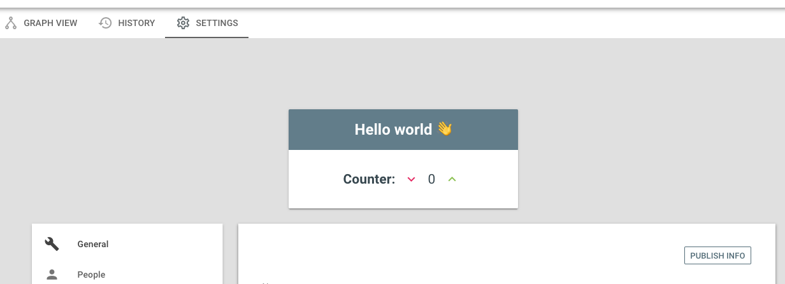

# TCE Example

<p align="center">
  <a href="https://github.com/vladimyr/tce-example/raw/master/screenshot.png">
    
  </a>
</p>

## Instructions

```sh
# inside git repo
pbcopy < tailor.patch
npm run build
TCE_SERVER_PORT=9090 npx http-server -p $TCE_SERVER_PORT ./dist
```
```sh
# switch to Tailor directory
pbpaste | git apply
```
